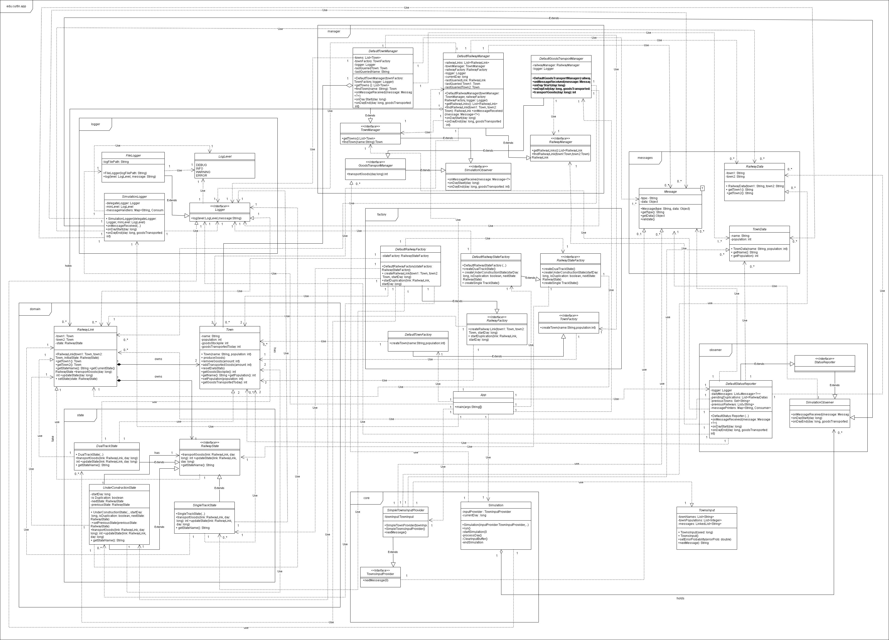
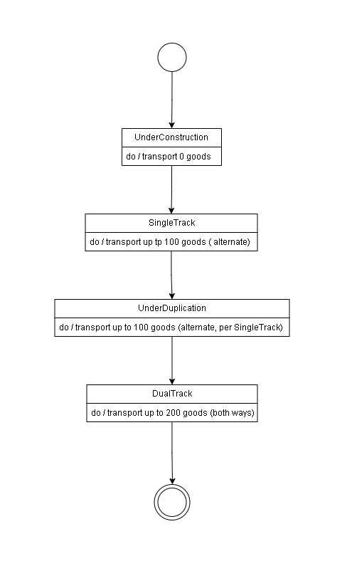

# Railway Network Simulator

A Java command-line simulation of a railway network where towns are founded, populations change, railways are constructed or duplicated, and goods are transported between connected towns over time.

The project focuses on object-oriented design and maintainable simulation architecture. It uses managers, factories, observers, state objects, generics, logging, and generated Graphviz output to model a changing railway network.

## Reviewer Quick Scan

- **What it demonstrates:** object-oriented simulation design, Observer and State patterns, manager/factory separation, logging, and Graphviz output.
- **Best files to inspect first:** [`docs/design-notes.md`](docs/design-notes.md), [`docs/diagrams/class-diagram.png`](docs/diagrams/class-diagram.png), and [`src/main/java/edu/curtin/app/`](src/main/java/edu/curtin/app/).
- **How to verify it:** run `./gradlew run`, inspect the console output, and convert `simoutput.dot` with Graphviz if desired.

## Features

- Simulates day-by-day railway network activity
- Processes town founding, population updates, railway construction, and railway duplication events
- Models single-track, dual-track, and under-construction railway states
- Transports goods between towns based on railway capacity and current track state
- Uses the Observer pattern to decouple simulation events from managers and reporters
- Uses the State pattern to handle railway behaviour changes cleanly
- Uses factories and constructor-based dependency injection for object creation
- Writes simulation logs to `simulation.log`
- Generates Graphviz DOT output in `simoutput.dot`

## Tech Stack

- Java
- Gradle
- PMD
- Graphviz DOT output

## Project Structure

```text
src/main/java/edu/curtin/app/
├── core/        # Simulation loop and input provider abstraction
├── domain/      # Town, railway link, and railway state models
├── factory/     # Factory interfaces and default implementations
├── logger/      # Logging abstraction and file logger
├── manager/     # Town, railway, and goods transport managers
├── messages/    # Generic simulation message models
├── observer/    # Observer interfaces and status reporting
└── App.java     # Application entry point and dependency wiring
```

## Design Overview

The application is split into small packages with separate responsibilities:

- `Simulation` controls the day-by-day loop and publishes events.
- `SimulationObserver` implementations respond to day-start, message, and day-end events.
- `TownManager`, `RailwayManager`, and `GoodsTransportManager` manage the main simulation state.
- `RailwayState` implementations control how railways behave while under construction, single-track, or dual-track.
- Factory interfaces create towns, railway links, and railway states without tightly coupling object creation to the simulation.

## Diagrams

### Class Diagram



### Railway State Diagram



## Proof and Review Evidence

| Evidence | Where to inspect it | What it proves |
|---|---|---|
| Design notes | [`docs/design-notes.md`](docs/design-notes.md) | The architectural patterns and package responsibilities are documented. |
| Class diagram | [`docs/diagrams/class-diagram.png`](docs/diagrams/class-diagram.png) | The object model is represented visually for review. |
| State diagram | [`docs/diagrams/state-diagram.png`](docs/diagrams/state-diagram.png) | The railway state transitions are documented separately from implementation. |
| Sample console output | [`docs/samples/sample-console-output.txt`](docs/samples/sample-console-output.txt) | Reviewers can inspect a captured run without executing the app first. |
| Sample Graphviz output | [`docs/samples/sample-network.dot`](docs/samples/sample-network.dot) | The repo includes concrete generated network output. |
| Source packages | [`src/main/java/edu/curtin/app/`](src/main/java/edu/curtin/app/) | Managers, observers, factories, states, and logging code are inspectable. |
| Static analysis config | [`oose-pmd-rules.xml`](oose-pmd-rules.xml) | The project includes configured static-analysis expectations. |

## Build

```bash
./gradlew build
```

## Run

```bash
./gradlew run
```

The simulation runs continuously and prints a daily status report. Press `Enter` to stop it.

## Run Checks

```bash
./gradlew check
```

This runs the configured Gradle checks, including PMD.

## Generate a Network Diagram

After running the simulation, `simoutput.dot` can be converted with Graphviz:

```bash
dot simoutput.dot -Tpdf -o simoutput.pdf
```

A sample DOT file is included at:

```text
docs/samples/sample-network.dot
```

## Sample Output

A short sample run is available here:

```text
docs/samples/sample-console-output.txt
```

## Notes

This repository contains a cleaned portfolio version of the project. Generated files such as build outputs, logs, `.gradle`, IDE folders, and runtime simulation outputs are excluded from version control.
